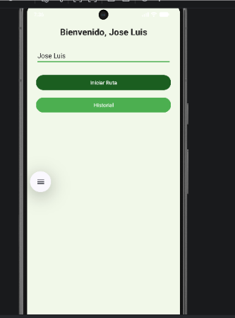
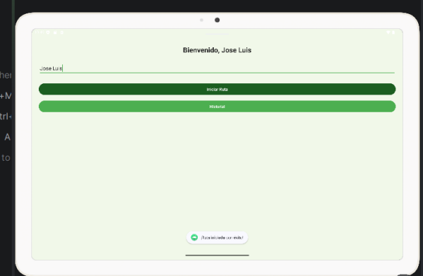

# PMDM_P1_JoseLuis - SenderosSevilla

Práctica 1 del módulo de Programación Multimedia y Despliegue de Dispositivos (PMDM).

## Descripción
Aplicación nativa en Android desarrollada en Java con Android Studio, centrada en el diseño de interfaces (XML), externalización de recursos, internacionalización y gestión básica de eventos en `MainActivity`.

## Funcionalidad de la Aplicación
La aplicación permite al usuario introducir su nombre en la pantalla principal y pulsar el botón **"Iniciar Ruta"**. Al hacerlo, la interfaz recupera dinámicamente el texto introducido mediante un recurso de cadena parametrizado (`strings.xml`) y actualiza el saludo superior de manera personalizada (por ejemplo, *“Bienvenido, Jose Luis”*), mostrando además un mensaje emergente (`Toast`) de confirmación.

## Capturas de Ejecución

**Versión Móvil:**

**Versión Tablet:**

## Ejecución
1. Clonar el repositorio.
2. Abrir el proyecto en **Android Studio**.
3. Sincronizar las dependencias de Gradle.
4. Ejecutar la aplicación en un emulador configurado (como Pixel 7).

## Autor
* Jose Luis Martín Blanco 
